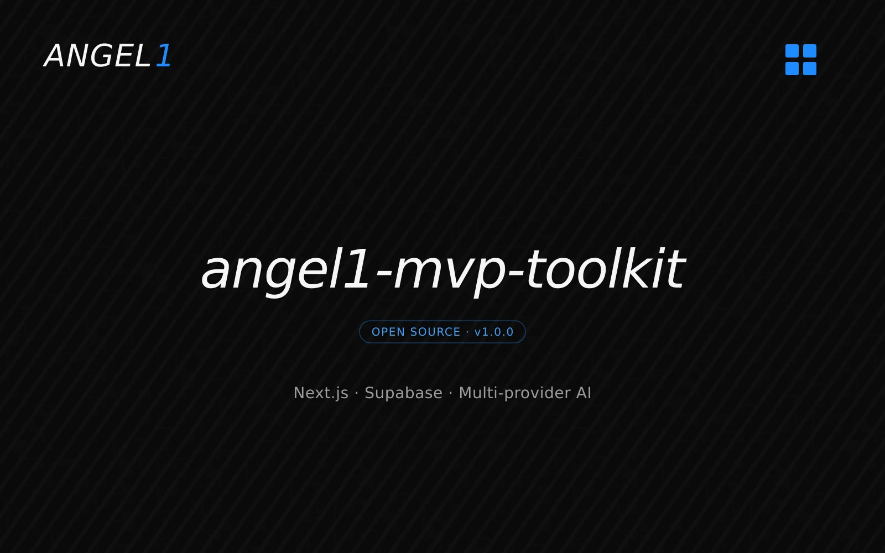
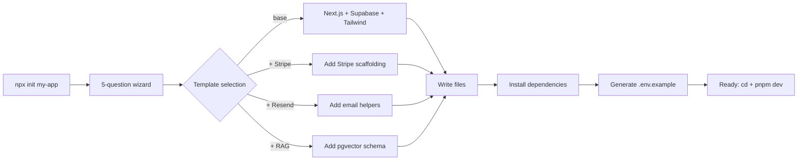

# angel1-mvp-toolkit

CLI that scaffolds production-ready Next.js + Supabase apps with multi-provider AI (Claude, OpenAI, or both) in seconds. Answer 5 questions and get a fully configured project with auth, optional Stripe + Resend + RAG, TypeScript strict, Tailwind 4, and a pre-wired `.claude/` workspace.

**On npm →** [`@massiangelone/angel1-mvp-toolkit`](https://www.npmjs.com/package/@massiangelone/angel1-mvp-toolkit)

Part of the `angel1-*` toolkit series.



## Quickstart

```bash
npx @massiangelone/angel1-mvp-toolkit init my-app
```

You'll be asked:

1. AI provider? (Anthropic / OpenAI / Both)
2. Auth? (Supabase / NextAuth)
3. Add Stripe?
4. Add Resend?
5. RAG support?

Then:

```bash
cd my-app
cp .env.example .env.local
pnpm dev
```

## What you get

- **Next.js 16** App Router + TypeScript strict
- **Supabase** (auth + DB + optional pgvector)
- **Multi-provider AI** — Anthropic and/or OpenAI behind a thin abstraction in `src/lib/ai/`
- **`.claude/` workspace** — agents, commands, docs optimized for AI-assisted dev
- **Tailwind 4** + postcss
- **Vitest** + Playwright scaffold
- **Optional Stripe** — checkout, webhooks, customer portal stubs
- **Optional Resend** — transactional email scaffolding
- **Optional RAG** — pgvector schema + ingestion utilities

## Architecture



The CLI composes the final project from a base template plus opt-in fragments, then runs `pnpm install` in the target directory. No post-init network calls — the wizard answers fully determine the output.

## Multi-provider AI

Choose your AI provider at scaffold time:

- **Both (recommended)** — Anthropic + OpenAI installed, switchable via `AI_PROVIDER` in `.env`
- **Anthropic only** — Claude + Voyage embeddings
- **OpenAI only** — GPT + OpenAI embeddings

The generated template uses a thin abstraction in `src/lib/ai/` so application code stays provider-agnostic:

```ts
import { getProvider } from '@/lib/ai'

const ai = await getProvider()
const result = await ai.generate({
  messages: [{ role: 'user', content: 'Hello' }],
})
```

Same code works with Claude or GPT. Switch by changing one line in `.env`:

```env
AI_PROVIDER=anthropic
# AI_PROVIDER=openai
```

## Repo structure

```
.claude/                Agents, commands, docs for AI-assisted dev
docs/                   Deep-dive documentation
packages/
  cli/                  The CLI published to npm
    src/                TypeScript source
    templates/          Project templates the wizard composes
    scripts/            Dev + release helpers
  templates/
    base/               Shared base template
```

## Develop locally

```bash
git clone https://github.com/maxange-developer/angel1-mvp-toolkit
cd angel1-mvp-toolkit
pnpm install
pnpm -r build

# Test the CLI against a scratch directory
node packages/cli/dist/index.js init /tmp/test-app
```

See [docs/README.md](docs/README.md) for the deep-dive on templates, fragments, and release flow.

## Status

Stable (v1.0.0).

- **`init` command** — production-ready, all 5 wizard branches tested
- **Multi-provider AI** — both Claude and OpenAI providers validated end-to-end
- **Optional integrations** — Stripe, Resend, RAG paths all scaffolded and runnable
- **Templates** — Next.js 16 + React 19 + Tailwind 4 baseline kept current

## Scope

`angel1-mvp-toolkit` is published on npm and is the same scaffolding I use to start client engagements. It is opinionated: the questions it asks reflect my own stack choices, not industry consensus. The [case study](https://massimilianoangelone.com/work/angel1-mvp-toolkit) covers the design rationale and trade-offs.

## License

MIT.

## Related

Part of the `angel1-*` series of open-source tools for AI-enhanced product development:

- **[angel1-rag-eval](https://github.com/maxange-developer/angel1-rag-eval)** — Evaluate RAG pipelines: retrieval precision, faithfulness, correctness. Pairs with this toolkit to measure RAG endpoints scaffolded with the optional RAG flag.

## Author

Built by [Massimiliano Angelone](https://massimilianoangelone.com) — AI-Enhanced MVP Developer, Tenerife.
